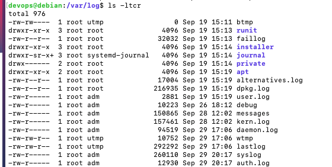
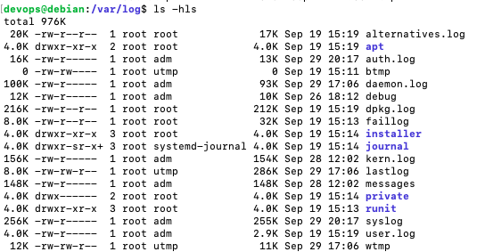
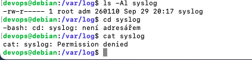
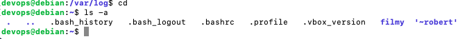
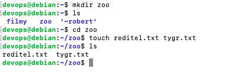
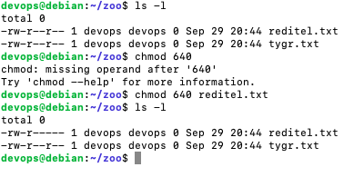
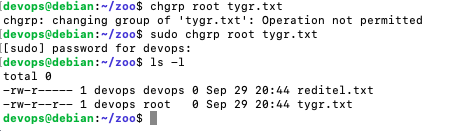
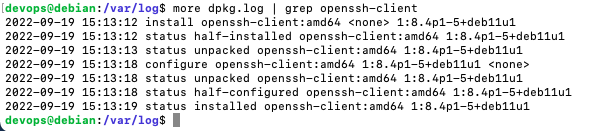
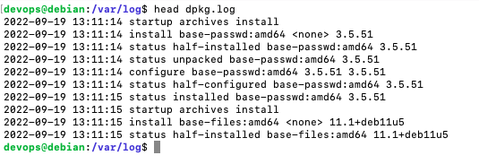
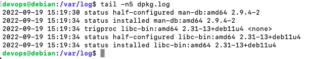

Zadání:
Vyzkoušejte si práci v příkazové řádce vyřešením jednotlivých úkolů a
zodpovězte uvedené otázky.

Odevzdání:
- Termín: Do příští lekce
- Způsob: Výpis z terminálu, popř. screenshot

Tipy:
- Využijte základní Linuxové příkazy z předchozích slidů
- Pro zjištění, co všechno příkaz umí, můžete využít:
- Manuálové stránky příkazu (např. pro příkaz ls použijete: man ls)
- Nápovědu příkazu (např.: ls --help)

1a) Vypište obsah adresáře /var/log, seřazený vzestupně dle data modifikace
(nejnovější bude dole)

1b) Zobrazte velikosti souborů v tomto adresáři v „lidsky čitelné podobě“ (např. místo
hodnoty v bytech 4224 se zobrazí hodnota 4,2K)

1c) Komu patří /var/log/syslog? Můžeme jej číst my, jako uživatel devops?

2a) Vypište ve svém domovském adresáři soubory, vč. skrytých souborů a adresářů

2b) Ve svém domovském adresáři vytvořte adresář zoo a v něm soubory:
- reditel.txt
- tygr.txt

2c) Odeberte ostatním uživatelům veškerá práva k souboru reditel.txt

2d) Změňte skupinu souboru tygr.txt na sudo

3a) Z logu /var/log/dpkg.log zjistěte, kdy byl nainstalován balíček openssh-client

3b) Vypište začátek souboru /var/log/dpkg.log

3c) Vypište posledních 5 řádků souboru /var/log/dpkg.log

