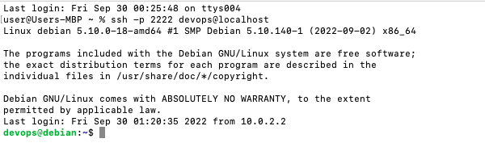

Zadání:
Nastavte si přihlašování SSH klíčem, abyste nemuseli při připojení ke svému
virtuálnímu serveru psát heslo.

Odevzdání:
- Termín: Do 7. lekce
- Způsob: Stačí screenshot terminálu po přihlášení

Tipy:
- Hrubý postup najdete na následujících slidech
- Nebojte se použít podrobné návody z internetu
- Hledejte, ptejte se a konzultujte na Slacku

Přihlášení ssh klíčem:
- Místo hesla se prokazujeme klíčem
- “Něco, co vím” vs. “něco, co mám”

- Princip: asymetrická kryptografie
- Dva klíče:
- soukromý (private)
- veřejný (public)
- Vy máte soukromý klíč, server má váš veřejný klíč

Co potřebujeme:
- Pár SSH klíčů (soukromý + veřejný)
- kde klíče vezmeme?
- Na server přidat svůj veřejný klíč
- jak ho tam nahrajeme?

Postup pro Linux/macOS:
- Na svém počítači vygenerujeme klíče (pokud je ještě nemáme):
- ssh-keygen -t rsa -b 4096
- Veřejný klíč nahrajeme na server:
- ssh-copy-id -p 2222 -i ~/.ssh/id_rsa.pub devops@localhost
- Přihlásíme se
- pokud jsme klíč zašifrovali, zadáme heslo ke klíči
- pokud máme klíč bez hesla , jsme rovnou připojeni

